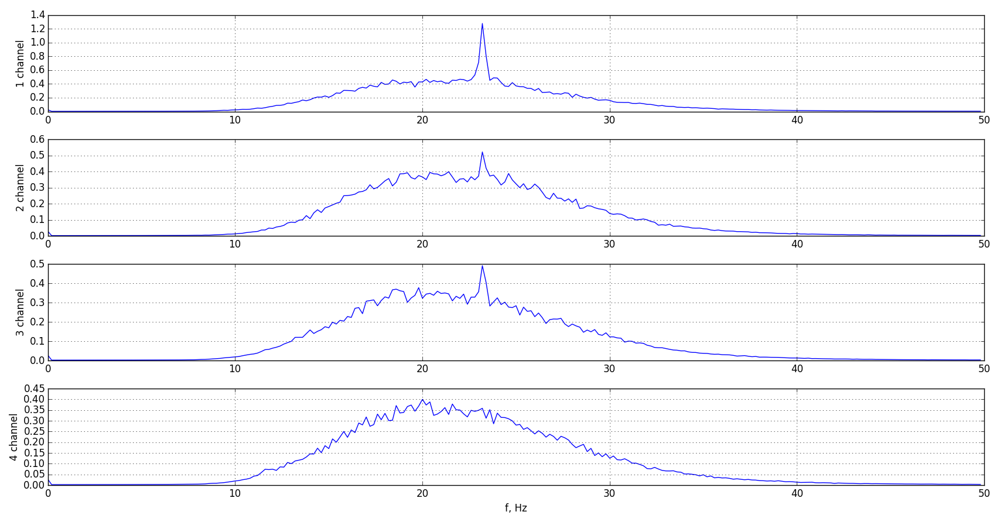
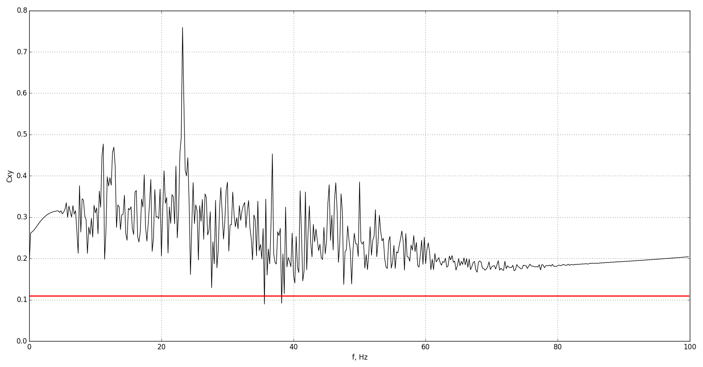
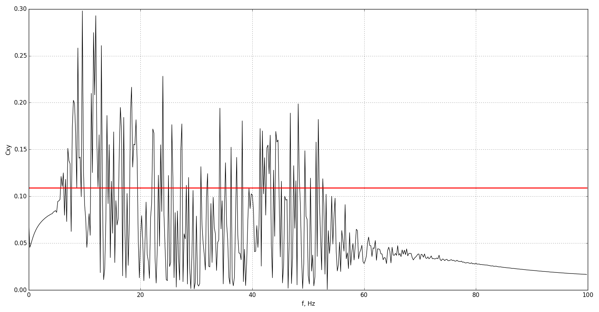
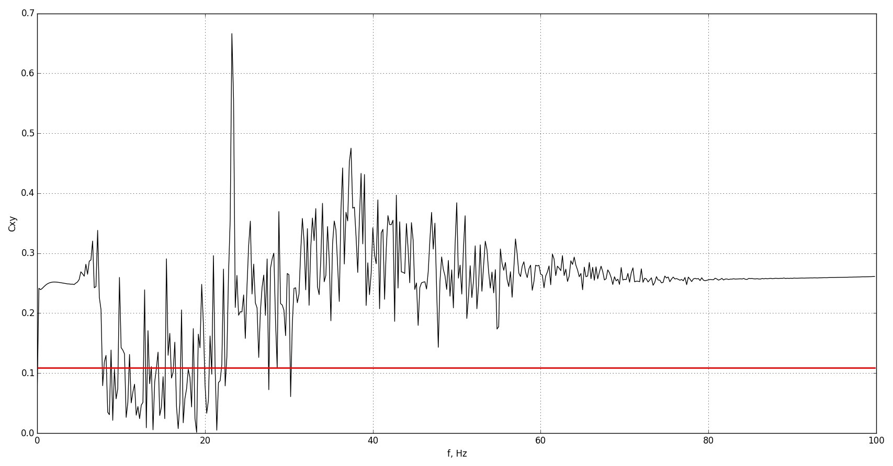
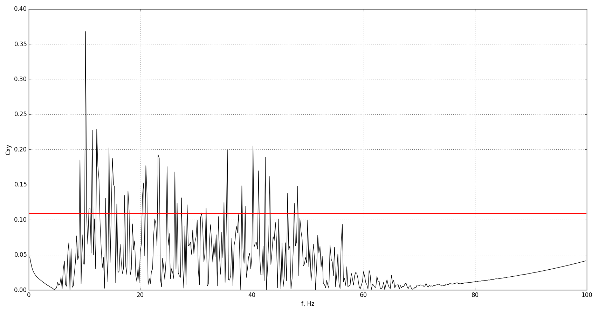

# Coherence function EEG

## Description

We continue to analysis real [EEG data](https://github.com/rcv911/periodogram/tree/master/data%20files) from one subject.
Coherence function in biomedical signal processing shows relation between two signals. The coherence function
allows us to find common frequencies and to evaluate the similarity of signals.
However, it doesn't give any information about time. 
>There are two often used methods to calculate the coherence function: Welch method and
MVDR (Minimum Variance Distortionless Response) method.

We are going to use just coherence function. It yields the information about frequencies occurring
in signals and the dominant frequency for these signals.

>We are going to analysis this spectrum from [this repository](https://github.com/rcv911/spectrum-average) 
 

## Motivation

Analysis of biosignals is one of the most important thing now. Doctors doesn't have skills in programming languages, 
but they know a lot about medical things. Programmers can solve this problem, creating tools for doctors and helping them with detecting or 
estimating quickly. 

## Results

Here's EEG coherence function EEG between channels. Red line is [95% confidence level.](https://en.wikipedia.org/wiki/Confidence_interval) 
True value is above confidence level.

CF between 1st and 2nd channels

CF between 3th and 4th channels

CF between 1st and 3th channels

CF between 2nd and 4th channels

## Learn more

- [Wiki Coherence](https://en.wikipedia.org/wiki/Coherence_(signal_processing))
- [Wiki Confidence interval](https://en.wikipedia.org/wiki/Confidence_interval)
- You can use [scipy.signal.coherence](https://docs.scipy.org/doc/scipy-0.18.1/reference/generated/scipy.signal.coherence.html)
- [Wiki Welch method](https://en.wikipedia.org/wiki/Welch%27s_method)
- [MVDR method](http://www.cinc.org/archives/2004/pdf/213.pdf)

## Installation

You can use [Python](https://www.python.org/) with data package: [Anaconda](https://www.anaconda.com/) or [Miniconda](https://conda.io/miniconda).
There's another way - use [Portable Python](http://portablepython.com/). Also you can use whatever IDE for Python.

## License

Free